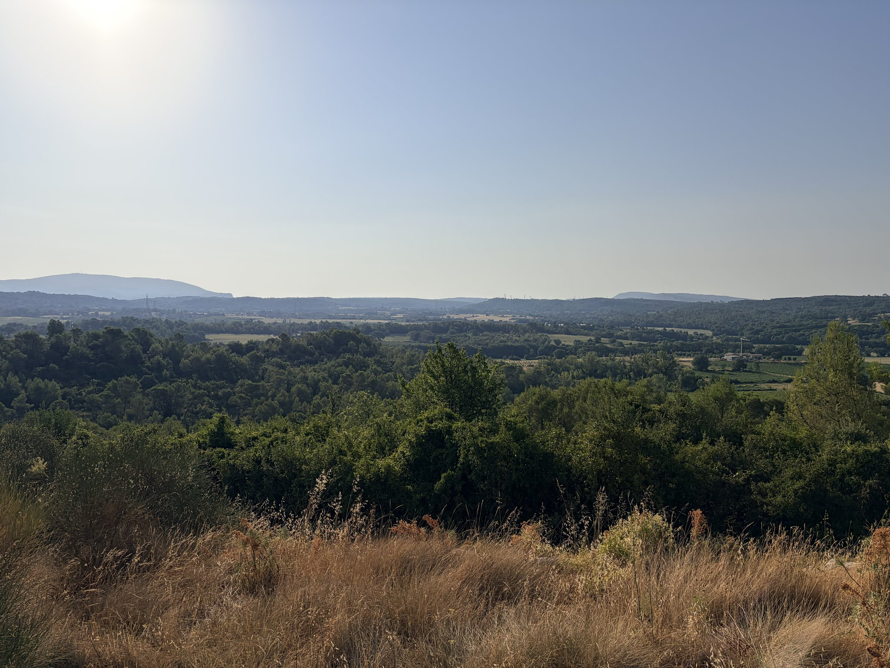
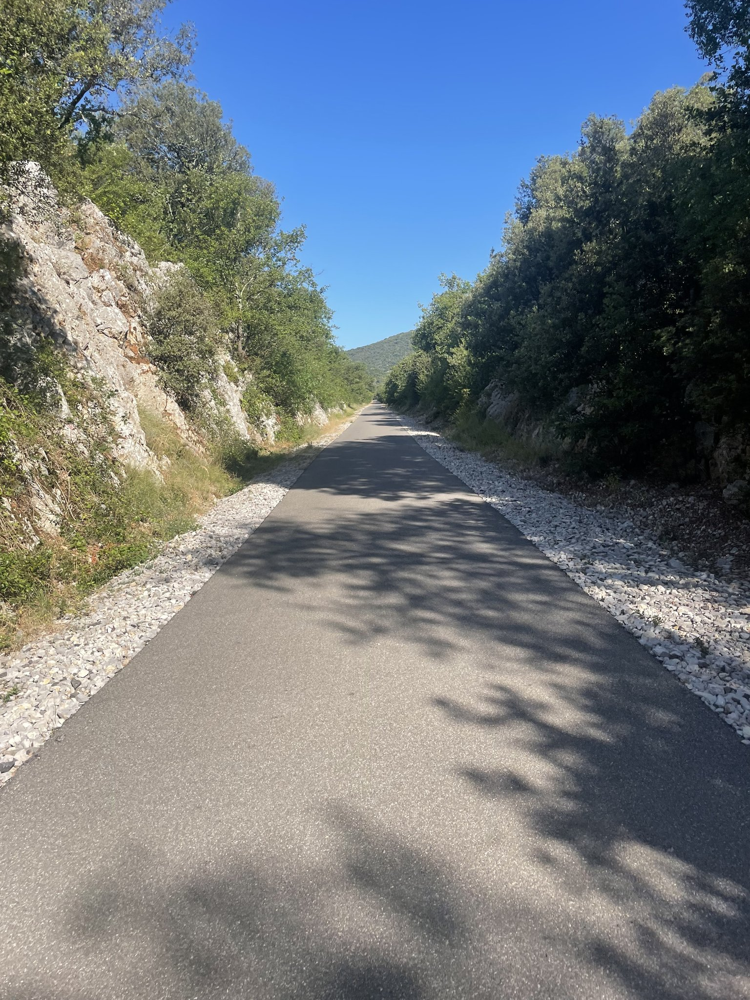
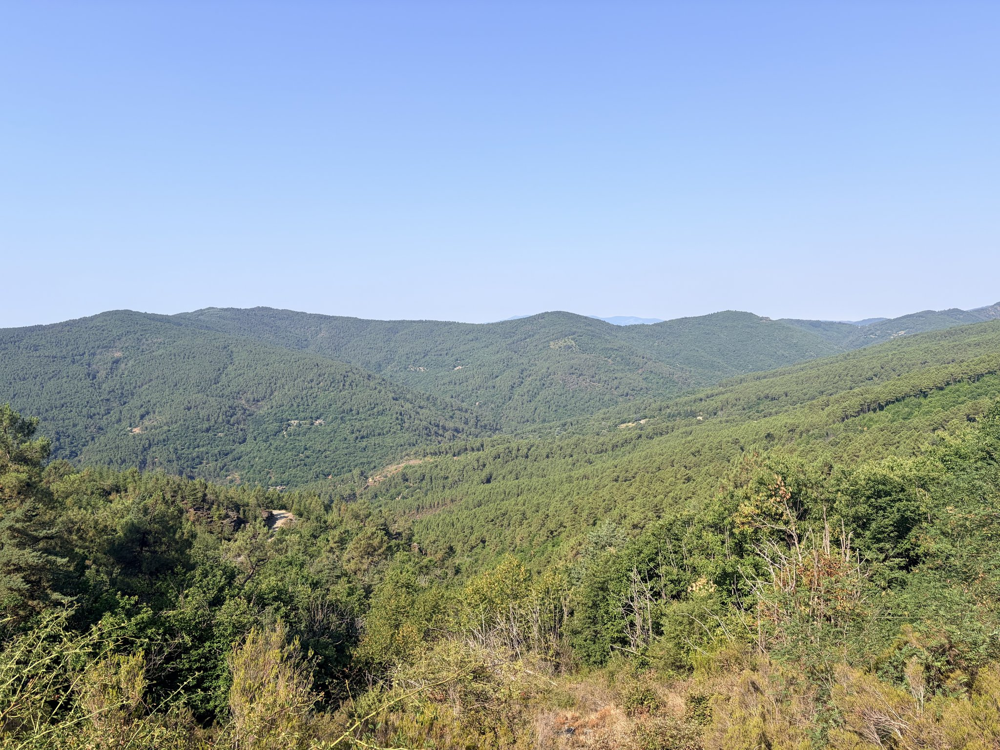
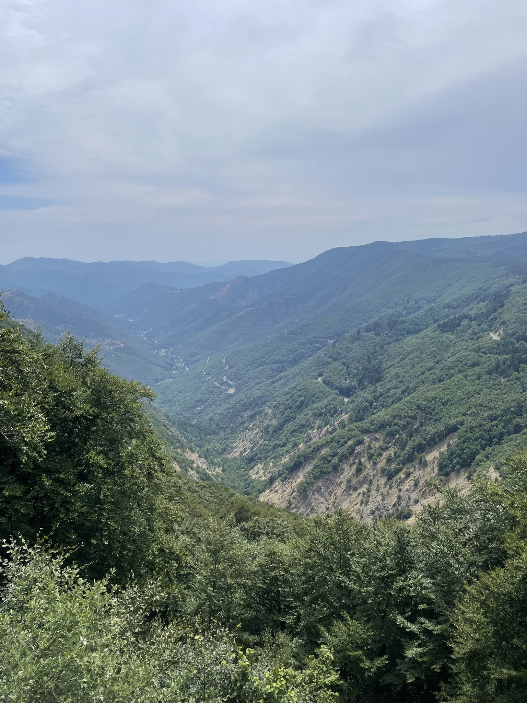
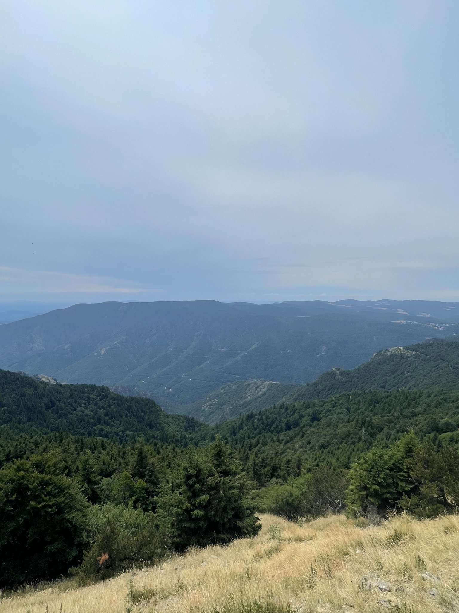
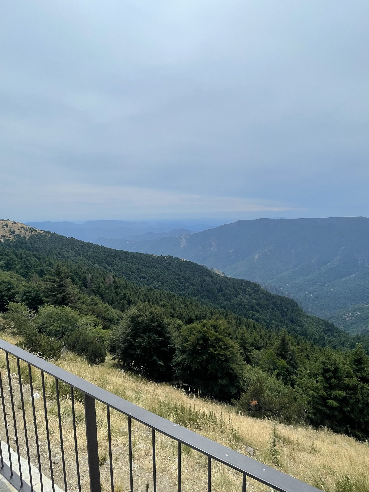
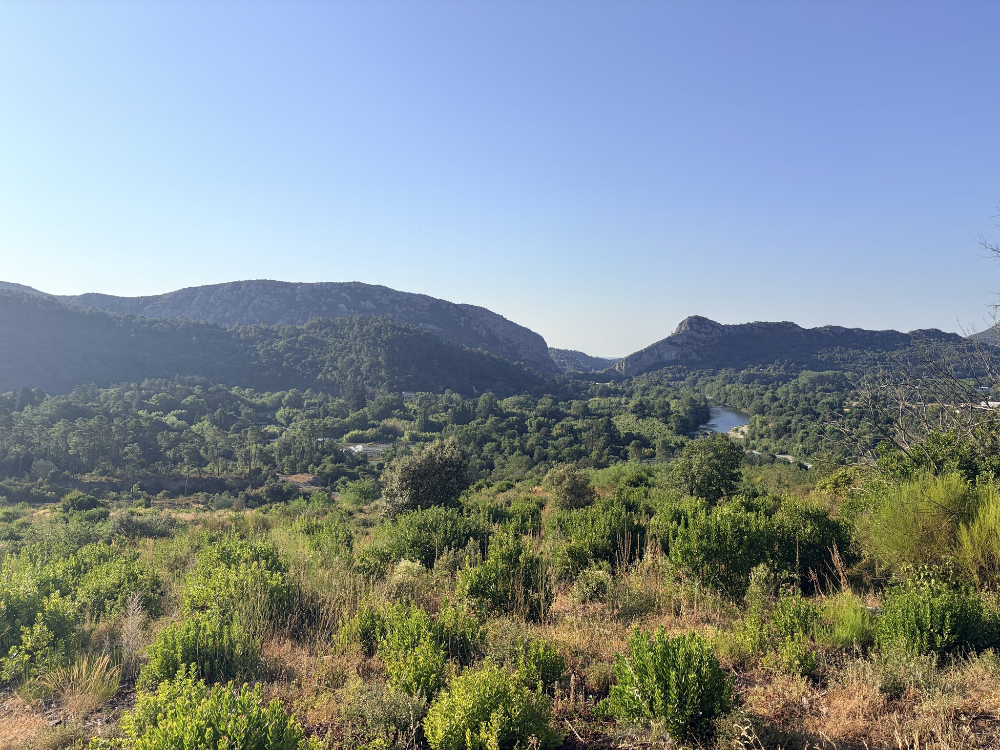

_Some places you visit once and tick off a list. The Cévennes are the opposite for me. This is a place I keep going back to, and a week there on the bike still feels short. I wish I could stay there for months._

## Why this region and not the big mountains

Every summer there is a version of the same conversation among cyclists, about which mountains you are going to. The answer is almost always the Alps or the Pyrenees, and I understand why, since the passes there are famous and the numbers are impressive.

The Cévennes are none of that. This is "moyenne montagne", where the summits sit somewhere between six hundred and fifteen hundred metres. Not something to impress people with on Instagram or on Strava, but I'm not the kind of person that lives for views. What you get instead is a landscape that feels much older and much quieter, ridge after ridge of chestnut and pine going dark green into the distance, roads that were built to link villages rather than to sell a ski resort, and entire afternoons where the only traffic is a tractor and a few Berlingo.

It also happens to suit me far better. I am tall, I am not a light climber, and long stretches above ten percent are where my week stops being a holiday. The Cévennes climbs are long without being brutal. They let you settle into a rhythm, and the descents are fun without being very technical, which lets you build confidence.

## The rhythm of the week

Mornings started early, because in July the heat arrives fast and the good hours are the ones before ten. The valleys around Alès are the natural place to begin, and from there every direction leads somewhere worth going.

Some of the easiest kilometres came on an old railway line that has been turned into a voie verte, a few metres wide, cut into the rock in places, running with a gentle gradient because trains never liked steep ones either. It is not the most dramatic riding of the week, but rolling along a shaded, car-free strip of tarmac with the river somewhere below is a very pleasant way to warm the legs up before the real climbing starts.

Going west from Alès takes you into the Gardon valleys, through Anduze and Saint-Jean-du-Gard, and then up into the Vallée Française towards La Barre-des-Cévennes. Going north-west instead, around Branoux-les-Taillades and La Grand-Combe, gives you a different Cévennes, a little more mineral, with old mining villages and roads that climb out of the valley in long patient switchbacks.

## Mont Aigoual

The one climb everybody asks about is Mont Aigoual, which at 1 565 metres is the high point of the massif and the only summit in the area that behaves like a proper mountain.

It is a long way up, and what makes it enjoyable is that the road keeps changing character. You spend a long time in the forest, with the valley opening below you at every turn, and then the trees thin out, the wind picks up, and the last part is bare and exposed with the observatory sitting on top like something from another century. Even at this time of year it is a bit cold up there, so I usually do not stay long.

## The first hour of the day

The best hour of most days is often the first one, before the heat arrives, when the light is still low and the road is empty because nobody is out yet. One coffee in the belly and the whole day is still in front of you.

A week is always too short. There are plenty of roads and valleys I have not visited yet, so there is a lot left to discover. One thing I noticed is that as soon as I enter the Lozère, the roads suddenly become smoother, and that is why I often head north-west to leave the Gard department.
