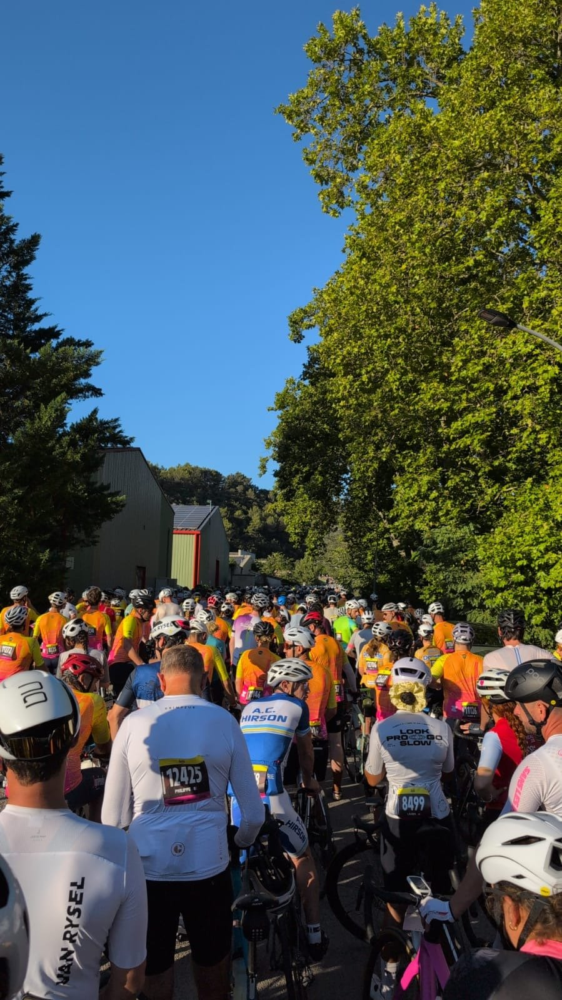
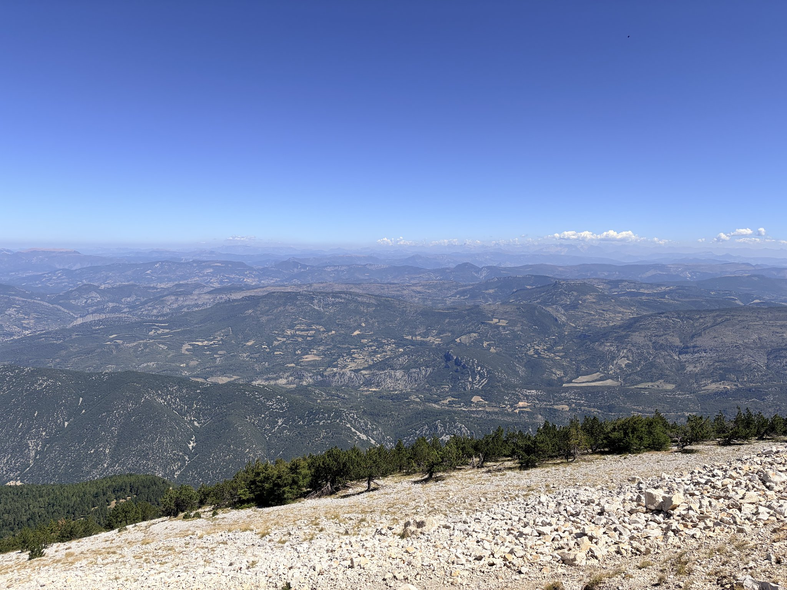
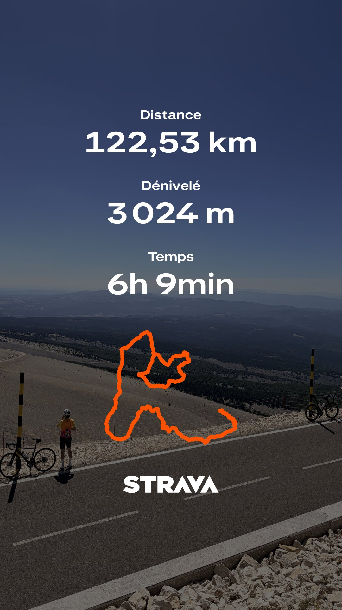

_There is a stretch on the Ventoux just after the Saint-Estève bend, where the road tilts up and then simply stays there. The forest closes in, the gradient holds around 9 to 10% for something like seven kilometres, and everybody around you gradually stops talking. That was the stretch where I found out whether five months of ordinary rides had been worth anything._

## The date matters more than the motivation

I wrote a few months ago that [motivation follows action](/posts/finding-the-rythm-again-one-climb-at-a-time) rather than the other way around, and I still think that is true, but it is only half of the story. Action itself needs something to get it started, and in my experience a sentence like "I should ride more" has never been enough to get me out of bed at six in the morning.

What tends to work far better for me and for most people I ride with is considerably simpler: you register for an event, you pay for it, and the calendar does a good part of the work from then on. In my case that was L'Étape du Tour de France Femmes avec Zwift, second edition, on Thursday 6 August 2026, running from Vaison-la-Romaine to the summit of Mont Ventoux, for 117 km and 2 950 m of climbing, with 10 500 riders on the start list.

Once that was booked, the daily question stopped being whether I felt like riding, because the date was not going to move and the Ventoux was not going to get any shorter or easier. What remained was a fixed number of weeks in which to rebuild some strength and some endurance, the only alternative being to turn up underprepared to a very long day in the heat.

## The five months in between

Back in March I was in Grasse rebuilding a base, riding short climbs and getting dropped on gradients that I used to enjoy. Between that week and August there was no breakthrough session and no magic block, only a fairly repetitive accumulation of small and unglamorous things:

- gym sessions, because sending a tall rider like myself up a 10% ramp on untrained legs rarely ends well
- rides after work, with the kit laid out in advance so that I could change the moment I walked through the door, before even thinking about lying down on the sofa
- one long ride every weekend, with the duration and the intensity going up gradually
- a large number of unremarkable weekday hours that felt as though they were achieving nothing at all

None of it was interesting to look at and very little of it felt like progress from the inside, but it was repeated, and that turned out to be the part that mattered: the date in the calendar is what made me consistent, and the consistency is what eventually made me strong enough to get to the top.

## What the research actually says about this

This is one of the better studied areas in behavioural science, and the findings line up with the experience closely enough to be worth going through.

[Locke and Latham](https://www.researchgate.net/publication/254734316_Building_a_Practically_Useful_Theory_of_Goal_Setting_and_Task_Motivation) spent thirty-five years building goal-setting theory out of several hundred studies, and their central result is that specific and difficult goals reliably produce better performance than a general encouragement to do your best, since vague intentions produce vague effort. "Ride more this year" belongs firmly in that second category, while "finish the Étape on 6 August" is dated, unambiguous and comfortably harder than anything I was capable of on the day I signed up.

[Ariely and Wertenbroch](https://www.researchgate.net/publication/11362417_Procrastination_Deadlines_and_Performance_Self-Control_by_Precommitment) looked at the deadline rather than the goal and found that students given the option to impose costly intermediate deadlines on themselves took it, and that those deadlines measurably improved their performance. People are broadly aware of their own self-control problems and are willing to buy constraints to compensate for them, which is precisely what a race entry is, and hiring a coach works the same way, since a good part of what you pay for is the accountability you feel towards somebody who set aside their time to help you improve.

[Gollwitzer and Sheeran](https://www.researchgate.net/publication/37367696_Implementation_Intentions_and_Goal_Achievement_A_Meta-Analysis_of_Effects_and_Processes) went one level lower, into how a goal turns into an action, by pooling 94 studies and more than eight thousand participants. They found that implementation intentions, meaning if-then plans of the form "when X happens, I will do Y", had a medium-to-large effect on goal attainment of around d ≈ 0.65, and what makes that striking is that the comparison group was not people without goals but people who already held the intention. Deciding to ride is therefore worth considerably less than deciding that on Tuesday evening you will go straight home, put your kit on and ride for two hours.

Put end to end, those results describe a fairly precise recipe: a goal that is hard, specific, dated and committed to in front of other people, broken into steps near enough to be reached soon, each producing progress you can actually see. That is four decades of literature, and it also happens to be a decent description of what training for a cyclosportive looks like.

## The same mechanism away from the bike

These principles are not specific to sport and they apply just as well to everyday life. As a software engineer I sometimes find myself using the same tricks when I want to work towards a certain goal.

Here is a short list of examples of how the same principle can be applied:

- book a certification exam and pay for it, since paying for something non-refundable is already a small commitment
- commit to building and publishing your own blog by a date you have said out loud to somebody
- give yourself a date by which you will have learned enough system design to have a framework you actually trust when somebody asks you to structure something from scratch

The last thing worth getting right is the size of the goal, which wants to be slightly too hard rather than impossible, because a target you privately know is out of reach produces a plan that never gets started, whereas one you can imagine reaching provided you do the work is what pulls you through the weeks in between.
